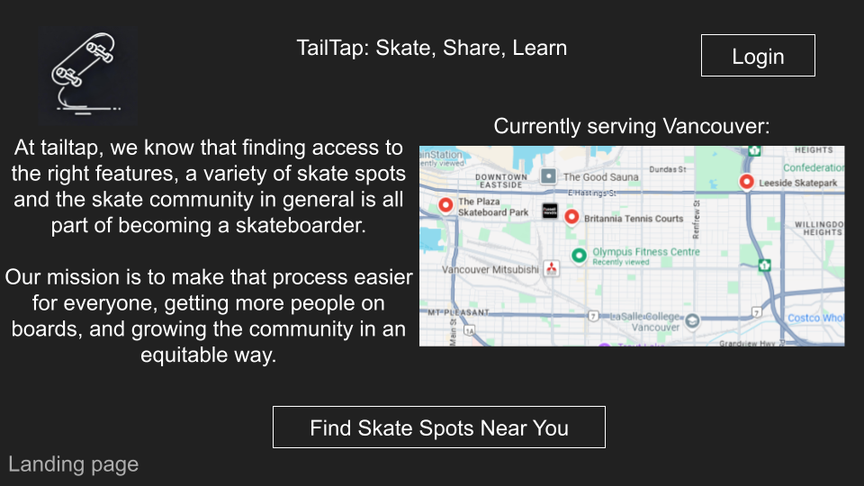
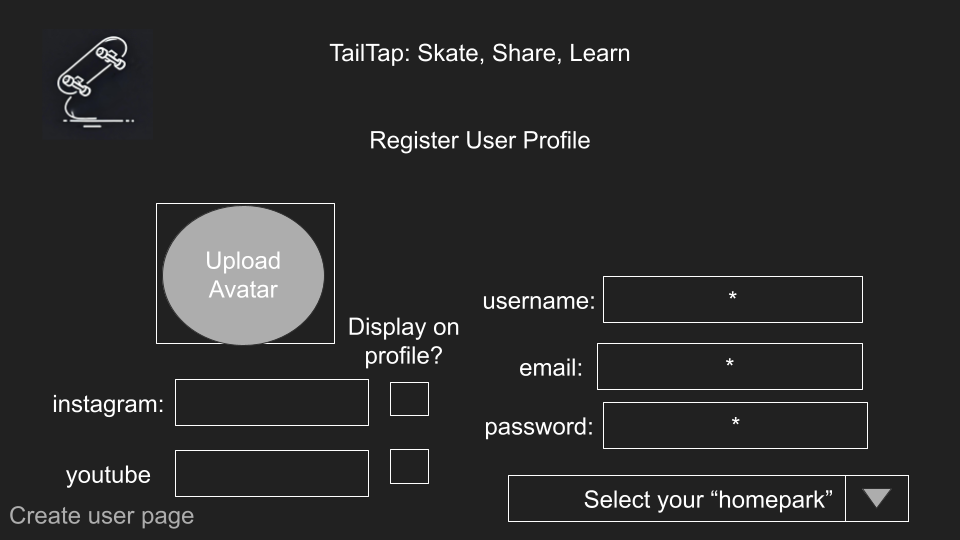
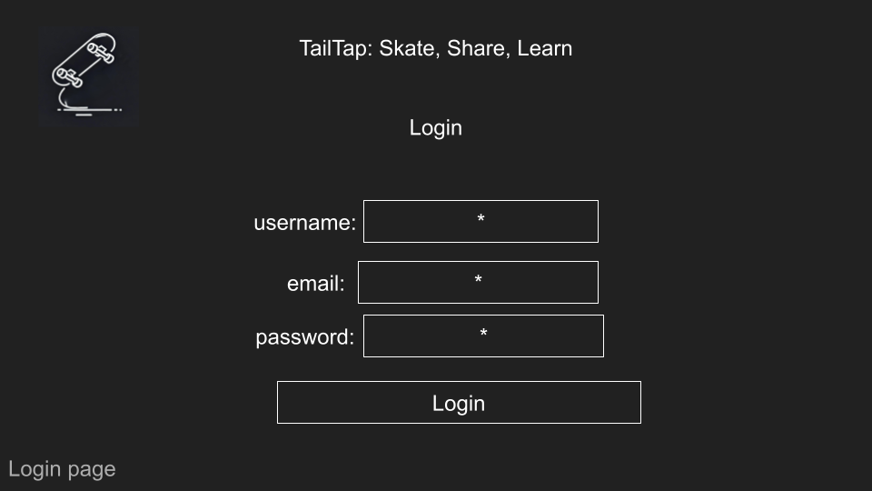
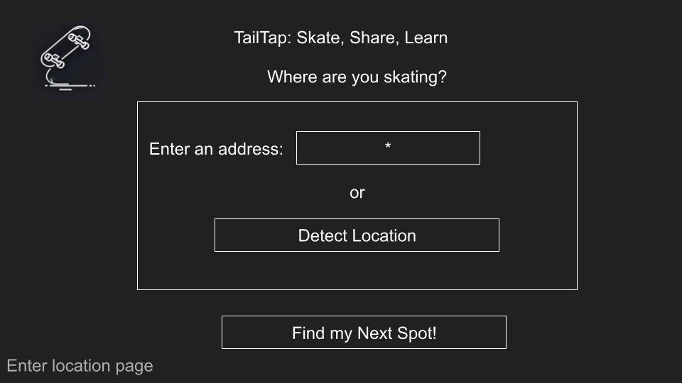
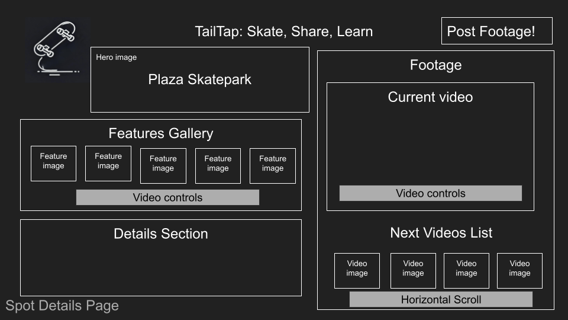
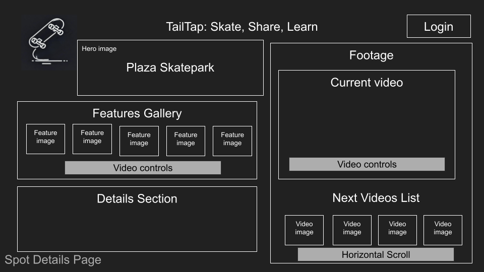
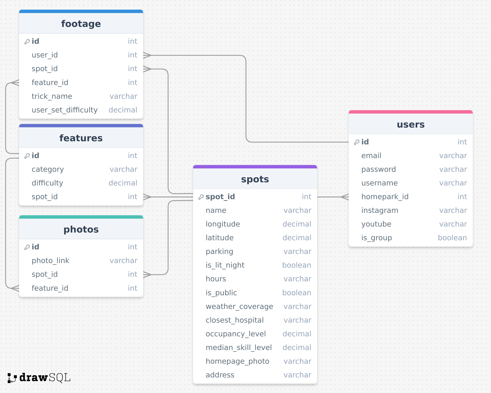

# Project Title
TailTap.io

## Overview

TailTap is a platform for skateboarders to find and share information regarding skateboarding locations.

### Problem Space

As a potential, beginner or experienced skateboarder, finding the right skate spot/skate features and accessibility features is integral to your progression in the sport.  Morevoer, as the skateboarding community calls these skate spots home, access to these spaces becomes integral to finding your skate community as well,
which is one of the best parts of the sport.

Whether you are a first time skater or a pro, it can be an arduous and often fruitless search through google maps, instagram, twitter and the like to find your next spot both at home and while travelling.  Each skateboarder requires a unique variety of skate features, accessibility features and diversity of community at different points in their life to get the most out of the activity.  Finding skate spots to accomodate those needs can be overwhelming and stressfull, detracting from the purpose of the activity which is fun.  

There is no current single location to find this information, and there is nothing worse than skating 2 hours to a spot only to find out the google maps photos were outdated and they ripped out your favorite feature.

### User Profile
- Potential and current skateboarders who are
    - looking to find new spots to skate
    - looking for certain features to skate
    - looking for people to skate with
    - looking to have a place to share and find skate footage


### Features

- As a user:
    - I want to be able to find the closest
    skate spots to my current location
    - I want to be able to find the closest skate spots to any given location
    - I would like to access information regarding these spots such as;
        - Detailed descriptions of features
        - Detailed photos of features
        - Accessibility information
        - General spot occupancy
        - Median spot skill level
        - Social media links to associated skate groups
        - Posted videos from other skaters from the spot
    - I would like to be able to filter by the following information
        - distance from location
        - specified skate features
        - accessibility features
        - general spot occupancy
        - median spot skill level
    

- As a logged in user, I want all the abilities of the regular user as well as
    - I want to be able to post videos on skate spot pages of me skating at that location

## Implementation

### Tech Stack

Front End
- React w Typescript + Vite
- Client libraries: 
    - react
    - react-router
    - axios

Back End
- Sqlite3 DB
- Node.js architecture
- Server libraries:
    - knex
    - express
    - bcrypt for password hashing

Deployement
- Heroku
- Netlify
- Github


### APIs

1. Google Distance Matrix API:
https://developers.google.com/maps/documentation/distance-matrix/overview

2. Google Geocoding API:
https://developers.google.com/maps/documentation/geocoding/overview#:~:text=The%20Geocoding%20API%20is%20a,Place%20ID%20into%20an%20address.


### Sitemap

- Home Page
- List Spots
- Spot Page
- Register
- Login
- Upload Form/Page


### Mockups

#### Landing Page


#### Register Page


#### Login Page


#### Enter Location Page


#### View Spots Page


#### View Spot Page (Authorized User)


#### View Spot Page


### Data



### Endpoints

**GET /spots**

- Get spots

Parameters:
- longitude: User-provided location as a number
- latitude: User-provided location as a number

Response:
```
    {
        "id": 1,
        "name": "Plaza Skatepark",
        "distance": 0.25,
        "parking": "google_maps_image.svg",
        "isLitNight" : true,
        "weatherCoverage": "partial",
        "is_public": true,
        "hours": "24/7"
        "occupancyLevel": .9,
        "medianSkill": .75,
        "homepage_photo": "spot_hero.svg"
        "address": "555 Road Rash Avenue"
    },
    ...

```

**GET /spots/:id/features**

- Get features by spot id

Parameters:
- id: Spot id as a number

Response:
```
{
    "id": 1,
    "spotId": 1,
    "featureId": 1,
    "name": "Red Hand Rail",
    "photo": "red_hand_rail.svg",
    "category": "rails",
    "difficulty": .5
} ...
```

**GET /spots/:id/footage**

- Get footage by spot id

Parameters:
- id: Spot id as a number

Response:
```
{
    "id": 1,
    "spotId": 1,
    "featureId" 1,
    "userId" 1,
    "title": "Huge bail on the red hand rail!"
    "footage": "user1Video1.mp4"
    "user": "CementSurfer"
    "postDate": "April 1st, 2024"
    "description": "Went for the frontside 360 to boardslide on the red hand rail, but I keep over rotating and I totally ate it off the one side!"
} ...
```

**POST /spots/id/footage**

- Logged in user can post footage at a spot

Parameters:
- id: Spot id
- token: JWT of the logged in user

Response:
```
{
    "id": 1,
    "spotId": 1,
    "featureId" 1,
    "userId" 1,
    "title": "Huge bail on the red hand rail!"
    "footage": "user1Video1.mp4"
    "user": "CementSurfer"
    "postDate": "April 1st, 2024"
    "description": "Went for the frontside 360 to boardslide on the red hand rail, but I keep over rotating and I totally ate it off the one side!"
} ...
```

**POST /users/register**

- Add a user account

Parameters:

- username: User's input name
- email: User's email
- password: User's pwd
- homepark_id: User's selected homepark
- exposedContacts: ["www.insta.com.user", "www.youtube.com/user"] (optional)
- isGroup: User selects if they are an individual or a group, this will effect future functionality

Response:
```
{
    "token": "abc123"
}
```

**POST /users/login**

- Login a user

Parameters:
- email: User's email
- password: User's pwd

Response:
```
{
    "token": "abc123"
}
```


### Auth

- JWT auth
    - Initially, all API requests will be using a fake user with id 1
    - Store JWT in localStorage, remove when a user logs out
    - Logged in state will modify UI based on mockups

## Roadmap

- Create client
    - react project with routes w boilerplate html/scss

- Create server
    - express project with routing, with placeholder responses

- Create migrations

- Gather 5 sample skatespot geolocations in Vancouver

- Gather/fabricate data for spots table
    -google

- Gather/fabricate data for features table (1-5 features per spot)
    -go skate!

- Gather/fabriate data for footage table (1 clip per feature)
    -go skate!
    -ask friends, people on socials
    -hold a few skate sessions

- Gather/fabricate data for photos table (1 photo per feature, a homepage photo for the spot)
    -can mine some of these from google, take photos of the others myself

- Create seeds with sample data

- Deploy client and server projects via Heroku and Netlify respectively

- Feature: List skatespots from a given location
    - Implement list spots page including location form
    - Store given location in sessionStorage
    - Create GET /spots endpoint

- Feature: View skatespot
    - Implement view skatespot page
    - Create GET /spots/:id/footage
    - Create GET /spots/:id/features

- Feature: Home page

- Feature: Create account
    - Implement register page from header nav + form
    - Create POST /users/register endpoint

- Feature: Login
    - Implement login page from header nav + form
    - Create POST /users/login endpoint

- Feature: Post Footage
    - Implement upload page from spot page + form
    - Create POST spots/:id/footage

- Feature: Implement JWT tokens
    - Server: Update expected requests / responses on protected endpoints
    - Client: Store JWT in local storage, include JWT on axios calls

- Bug fixes

- DEMO DAY

## Future Implementations
- Integrate Google Places / Maps
    - Visual radius functionality
- Ability to submit edits for spot information/details/features
- Ability to like/upvote footage
- Ability to comment on footage
- Ability to like comments
- A user home page to store uploaded videos
- The ability to bookmark footage
- Scrape "popular times" from google maps API


